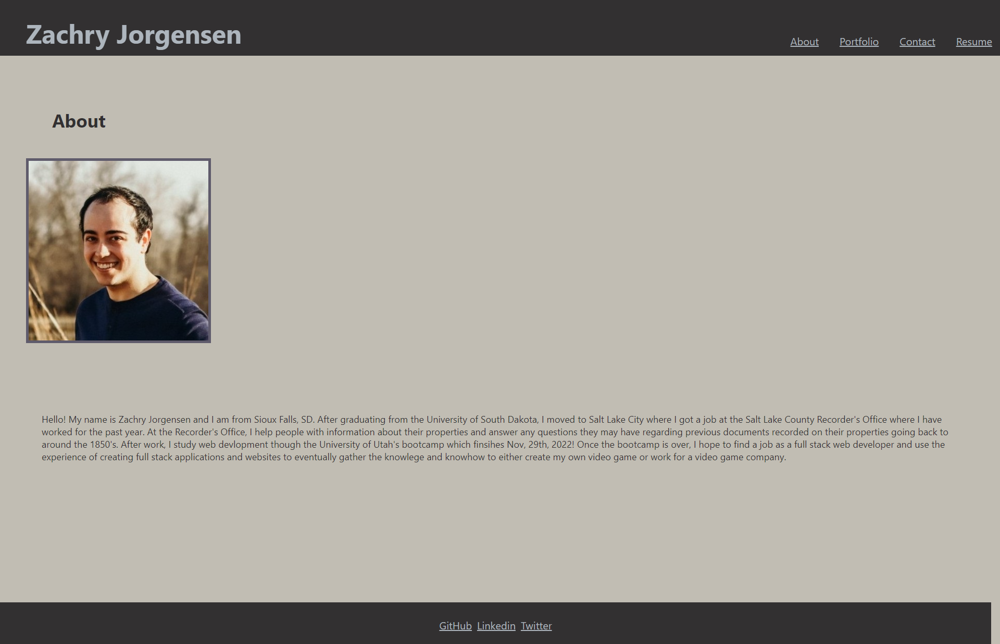

# React Porfolio

  [GitHub Application](https://github.com/zdjorgensen/React-Portfolio)

  [GitHub Pages Link](https://zdjorgensen.github.io/React-Portfolio/)

  ## Table of Contents

    
 Sections 

    <ul>
        <li> <a href="#description"> Description </a> </li>
        <li> <a href="#contact"> Contact </a> </li>
    </ul>    

  

  
(<a href="#top">Back to Top</a>)

  ## Description

  For challenge 20 `React Portfolio` I created a profession portfolio for myself using ReactJS. I struggled getting the navigation bar with the links to the different pages to work properly but after a while I was able to figure it out with the help of Google and previous class activities. While creating my portfolio I was able to learn about more about React's way of implementing CSS within the file, and I learned about an npm package for React that made it easier to create a grid system for my portfolio page. 
  I am not sure what happened to the GitHub Pages, at first it was only showing the Readme file but now it is just a blank site.

  When my portfolio is initially loaded the user is shown an about me page that has a breif description of who I am, what I currently do, and what some of my goals are for the future. In the navigation bar, if the user clicks on any of the other links, they are taken to a portfolio page with previous challenges I created, a contact page where the user can submit a form, and a resume section with a downloadable version of my resume and some of my proficiencies on front-end and back-end developments. 
  
(<a href="#top">Back to Top</a>)

  

  

  ## Contact
  GitHub: [zdjorgensen](https://github.com/zdjorgensen)
  
  Email: z.d.jorgensen@gmail.com

  
(<a href="#top">Back to Top</a>)

 
  